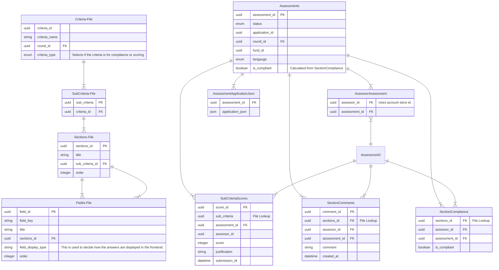

```mermaid
erDiagram
	SubCriteria-File {
		uuid sub_criteria PK
		uuid criteria_id FK
	}
	Criteria-File {
		uuid criteria_id
		string criteria_name
		uuid round_id FK
		enum criteria_type  "Selects if the criteria is for compliance or scoring"
	}
	AssessorAssessment {
		uuid assessor_id FK "Uses account store id."
		uuid assessment_id FK
	}
	Assessments {
		uuid assessment_id PK
		enum status
		uuid application_id
		uuid round_id FK
		uuid fund_id
		enum langauge 
		boolean is_compliant  "Calculated from SectionCompliance"
	}
	Sections-File {
		uuid sections_id PK
		string title
		uuid sub_criteria_id FK		
		integer order
	}
	Fields-File {
		uuid field_id PK
		string field_key
		string title
		uuid sections_id FK
		string field_display_type "This is used to decide how the answers are displayed in the frontend."
		integer order
	}
	AssessmentApplicationJson {
		uuid assessment_id FK
		json application_json
	}
	SubCriteriaScores {
		uuid score_id PK
		uuid sub_criteria  "File Lookup"
		uuid assessment_id FK
		uuid assessor_id
		integer score
		string justification
		datetime submission_dt
	}
	SectionCompliance {
		uuid sections_id FK "File Lookup"
		uuid assessor_id FK
		uuid assessment_id FK
		boolean is_compliant
	}
	SectionComments {
		uuid comment_id PK
		uuid sections_id FK "File Lookup"
		uuid assessor_id FK
		uuid assessment_id FK
		string comment
		datetime created_at
	}
	
	
	Assessments ||--|{ SubCriteriaScores : ""
	Assessments ||--|{ SectionComments : ""
	Assessments ||--|{ SectionCompliance : ""
	Assessments ||--|{ AssessmentApplicationJson : ""
	Assessments ||--|{ AssessorAssessment : ""
	AssessorsAD ||--|{ SectionComments : ""
	AssessorsAD ||--|{ SubCriteriaScores : ""
	AssessorsAD ||--|{ SectionCompliance : ""
	AssessorAssessment }|--|| AssessorsAD : ""
	
	Criteria-File ||--|{ SubCriteria-File : ""
	SubCriteria-File ||--|{ Sections-File : ""
	Sections-File ||--|{ Fields-File : ""
	Sections-File ||--|{ Fields-File : ""

```
