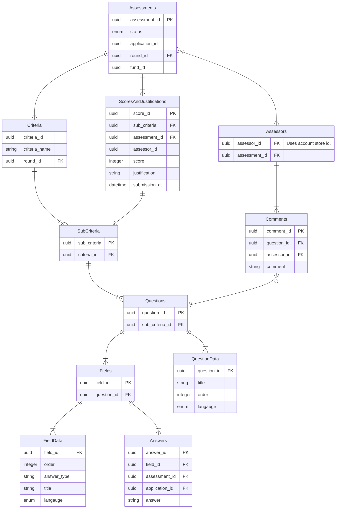

```mermaid
erDiagram
	SubCriteria {
		uuid sub_criteria PK
		uuid criteria_id FK
	}
	Criteria {
		uuid criteria_id
		string criteria_name
		uuid round_id FK
	}
	Assessors {
		uuid assessor_id FK "Uses account store id."
		uuid assessment_id FK
	}

	Assessments {
		uuid assessment_id PK
		enum status
		uuid application_id
		uuid round_id FK
		uuid fund_id
	}

	Questions {
		uuid question_id PK
		uuid sub_criteria_id FK
	}
	Fields {
		uuid field_id PK
		uuid question_id FK
	}
	QuestionData {
		uuid question_id FK
		string title
		integer order
		enum langauge
	}
	FieldData {
		uuid field_id FK
		integer order
		string answer_type
		string title
		enum langauge
	}
	Answers {
		uuid answer_id PK
		uuid field_id FK
		uuid assessment_id FK
		uuid application_id FK
		string answer
	}
	ScoresAndJustifications {
		uuid score_id PK
		uuid sub_criteria FK
		uuid assessment_id FK
		uuid assessor_id
		integer score
		string justification
		datetime submission_dt
	}
	Comments {
		uuid comment_id PK
		uuid question_id FK
		uuid assessor_id FK
		string comment
	}
	Criteria ||--|{ SubCriteria : ""
	SubCriteria ||--|{ Questions : ""
	Questions ||--|{ Fields : ""
	Questions ||--|{ QuestionData : ""
	Fields ||--|{ FieldData : ""
	Fields ||--|{ Answers : ""
	Assessments ||--|{ ScoresAndJustifications : ""
	ScoresAndJustifications ||--|| SubCriteria : ""
	Assessments }|--|{ Assessors : ""
	Assessments ||--|{ Criteria : ""
	Assessors ||--|{ Comments : ""
	Comments }o--|| Questions : ""
```
